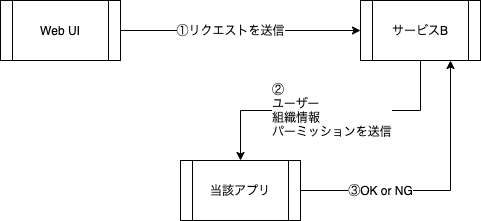

# Role Based N Security(RBAC)

リソースに対してロールベースの権限設定ができます。

## Table of Content

- [Role Based N Security(RBAC)](#role-based-n-securityrbac)
  - [Table of Content](#table-of-content)
  - [概要](#概要)
  - [対応データベース](#対応データベース)
  - [引数(camelCase)](#引数camelcase)
  - [環境変数(SNAKE_CASE)](#環境変数snake_case)

## 概要

組織、ユーザー別にリソースへのアクセス制限を行いたい場合に当該アプリを使用するで

ユーザーの権限管理が可能になります。

ある会社(組織A)に含まれるユーザーAが

A部署(組織B)に属している場合に

組織Aで、リソース操作する場合は読み取り権限、

組織Bで、リソース操作する場合は管理者権限

の様にあるユーザーが所属する組織別に異なる権限を持ち合わせる際に

設定を行うことでこのアプリケーションで判断可能です。

## 対応データベース

- PostgreSQL
- MySQL

今後対応予定としては、Oracle, SQLServer, SQLite3, IBMi(ODBC)

## 引数(camelCase)

| キー          | 説明                                                                                | デフォルト値  |
| :------------ | :---------------------------------------------------------------------------------- | :------------ |
| httpPort      | REST APIサーバーのポート番号                                                        | 8080          |
| grpcPort      | GRPC サーバーのポート番号                                                           | 8888          |
| debug         | デバッグモードで起動するかどうか                                                    | true          |
| whitelist     | IPアドレス制限で有効なIPを設定(CIDR形式)                                            | Blank         |
| secure        | API キーが必要かどうか(APIキーは自動生成)                                           | true          |
| ui            | Web画面で設定可能な画面を起動するかどうか                                           | true          |
| uiPrefix      | 静的ファイルのURLプレフィックス                                                     | /             |
| staticRoot    | 静的ファイルのあるディレクトリパス                                                  | ./static/dist |
| staticIndexes | URLパスがディレクトリの場合にディレクトリを表示するか(falseの場合,index.htmlを返す) | false         |
| envFiles      | .envファイルの指定(複数指定可)                                                      | Blank         |

## 環境変数(SNAKE_CASE)

| キー           | 説明                                                                                             | デフォルト値  |
| :------------- | :----------------------------------------------------------------------------------------------- | :------------ |
| DIALECTOR      | どのデータベースを使用するかを選択します                                                         | postgres      |
| MASTER_DSN     | Master Slaveで接続するため、Master DBの接続文字列を設定します                                    | Blank         |
| SLAVE_DSN      | Master Slaveで接続するため、SLAVE DBの接続文字列を設定します(からの場合MASTER_DSNが設定されます) | MASTER_DSN    |
| HTTP_PORT      | REST APIサーバーのポート番号                                                                     | 8080          |
| GRPC_PORT      | GRPC サーバーのポート番号                                                                        | 8888          |
| DEBUG          | デバッグモードで起動するかどうか                                                                 | true          |
| WHITELIST      | IPアドレス制限で有効なIPを設定(CIDR形式)                                                         | Blank         |
| SECURE         | API キーが必要かどうか(APIキーは自動生成)                                                        | true          |
| UI             | Web画面で設定可能な画面を起動するかどうか                                                        | true          |
| UI_PREFIX      | 静的ファイルのURLプレフィックス                                                                  | /             |
| STATIC_Root    | 静的ファイルのあるディレクトリパス                                                               | ./static/dist |
| STATIC_INDEXES | URLパスがディレクトリの場合にディレクトリを表示するか(falseの場合,index.htmlを返す)              | false         |
| ENV_FILES      | .envファイルの指定(複数指定可)                                                                   | Blank         |

引数の値をスネークケースで環境変数として設定することが可能です。
